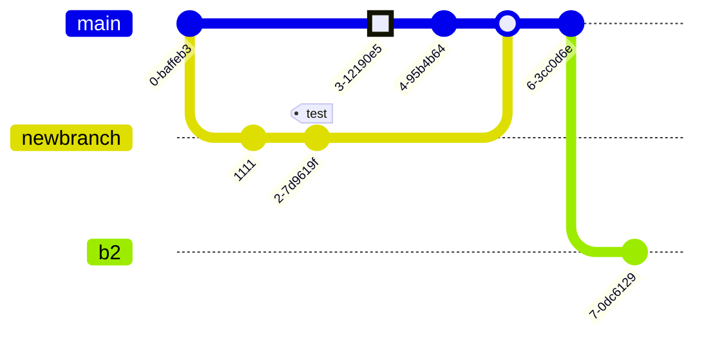

# PROJECT_NAME
## Technical

- This file will be rendered at `/#/technical`

### Mermaid Support;

---


### Prism Syntax Highlighting
\([many languages supported](https://github.com/PrismJS/prism/tree/gh-pages/components))

**_bash_**
```bash
#!/bin/bash
# A sample Bash script
echo Hello World!
```
**_scss_**
```scss
%toolbelt {
  box-sizing: border-box; border-top: 1px rgba(#000, .12) solid;
  &:hover { border: 2px rgba(#000, .5) solid; }
}
.action-buttons { @extend %toolbelt; color: #4285f4;}
.reset-buttons { @extend %toolbelt; color: #cddc39; }
```
**_toml_**
```toml
[[products]]
name = "Hammer"
sku = 738594937
[[products]]  # empty table within the array
[[products]]
name = "Nail"
sku = 284758393
color = "gray"
```